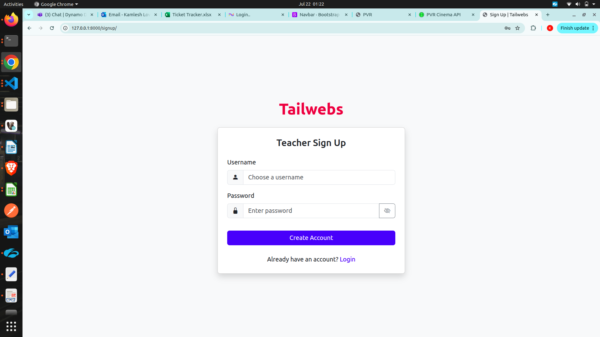
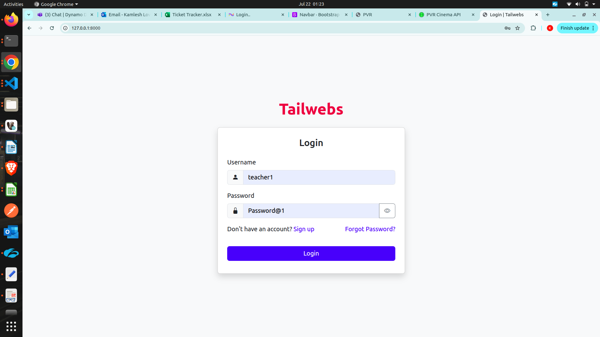
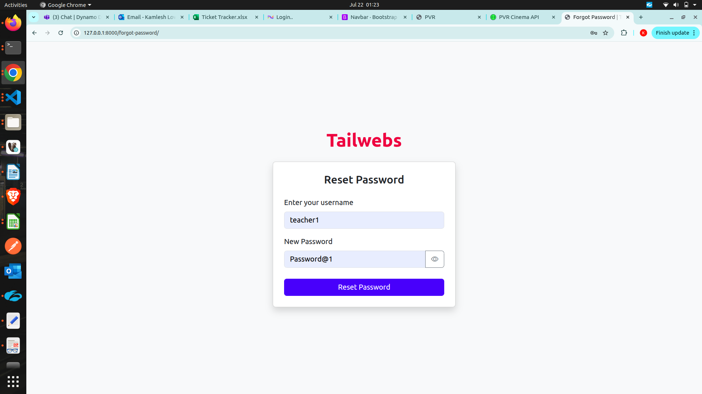
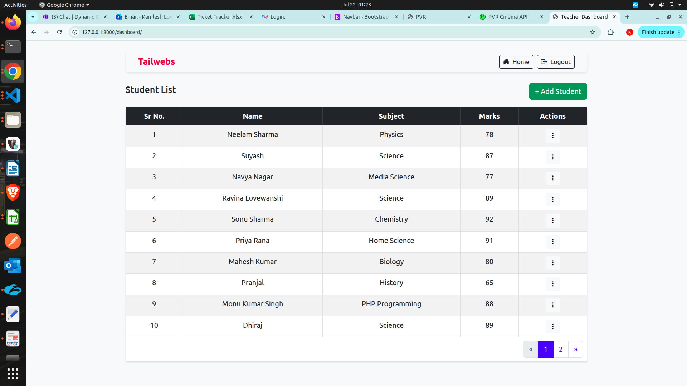

# 🧑‍🏫 Teacher Portal – Django Web Application

A simple yet extendable Teacher Portal web application built using **Django** and **Bootstrap 5**, allowing teachers to register, log in, manage profiles, and view dashboard data.

---

## 📦 Features

- ✅ Teacher Signup and Login
- ✅ Teacher Dashboard
- ✅ Bootstrap 5 UI with Responsive Design
- ✅ Secure Password Handling
- ✅ Django Messages (success/error alerts)
- ✅ Pagination with continuous serial numbers
- ✅ Soft delete Student record.
- ✅ Audit trails: `created_at`, `updated_at`, `created_by`, `updated_by`
- 🔒 Secure with CSRF protection & hashed passwords

---

## 🚀 Getting Started

Follow these instructions to run the project locally.

### 🧰 Prerequisites

- Python 3.8+
- pip
- virtualenv *(recommended)*

---

### 🛠️ Installation Steps

```bash
# Step 1: Clone the repository
git clone https://github.com/yourusername/teacher-portal.git
cd teacher-portal

# Step 2: Create a virtual environment
python -m venv venv
source venv/bin/activate  # On Windows: venv\Scripts\activate

# Step 3: Install dependencies
pip install -r requirements.txt

# Step 4: Apply migrations
python manage.py migrate

# Step 5: Create a superuser (optional)
python manage.py createsuperuser

# Step 6: Run the development server
python manage.py runserver

```

## Unit Test using this command
```bash
python manage.py test --verbosity=2
````
## Sample Teacher Credentials: 
username: admin
password: Password@1

---
## Tech Stack

- Backend   - Django

- Frontend   - HTML, CSS, Bootstrap 5, Vanilla JavaScript

- Database   - SQLite

---

## 📸 Screenshots

### Signup Page  


### Login Page  


### Forgot Password Page  


### Teacher Dashboard Page  


